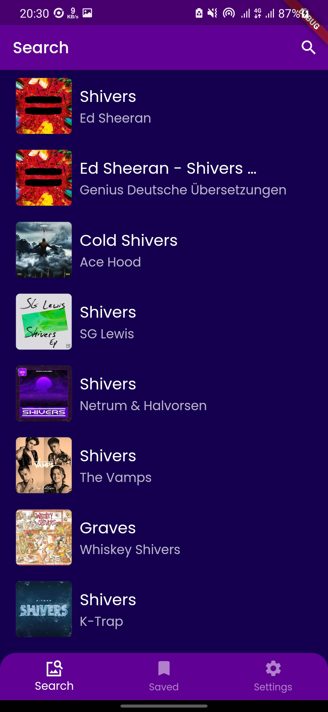

  
Flutter Lyrics App 
-------------    
 #### Flutter Version Used : 1.22.4
 The app uses [Genius API]("https://docs.genius.com/") to fetch song data and get lyrics.  
 To test the APK download it from the release files: [Download APK](https://github.com/mohammedhashim44/Flutter-Lyrics-App/releases/download/1.0.5%2B6/flutter_lyrics_v_1.0.6_7.apk)

 ## Screenshots   

  
   
    
    
   
    

  

-------------    

#### App Features:  
- Search for songs by name,artist or lyrics.
- View lyrics.
- Save songs lyrics for offline use.
- Animation for loading and error screens.
- Multiple themes and dynamic font size.
- Cached images.
-------------    
#### NOTE:  
- To build and run the app successfully you need to get access token from Genius.
- **It's free**, just create an account  in [Genius API]("https://docs.genius.com/")  and generate new token.
- After you get the token, put it in:
	- In the file : `lib/src/repositories/songs_repository.dart`
	- In the line: `const GENIUS_TOKEN = "YOUR_TOKEN_HERE";`
	- Put your token here.
-------------   
